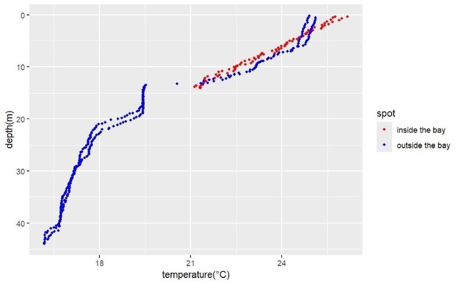
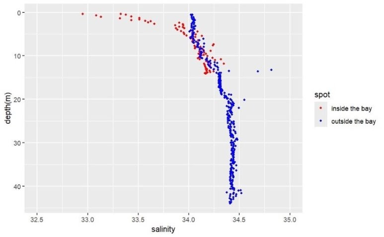
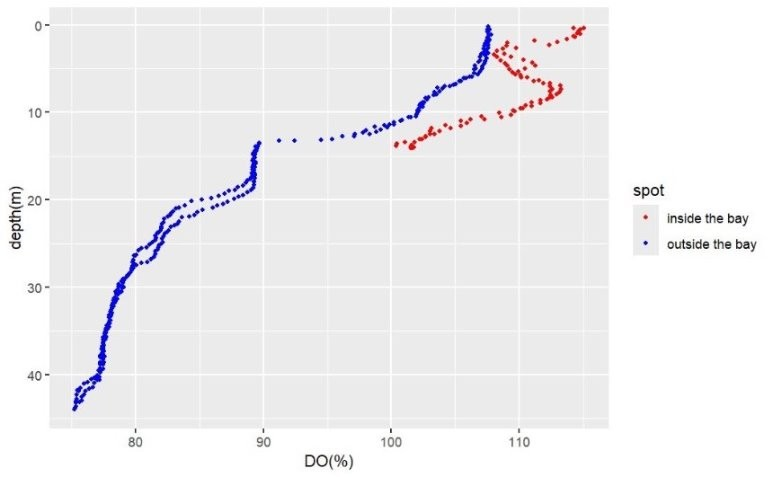
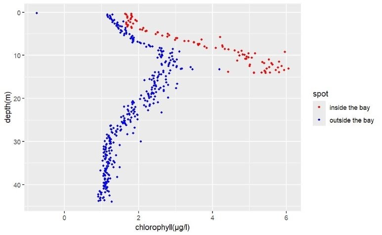
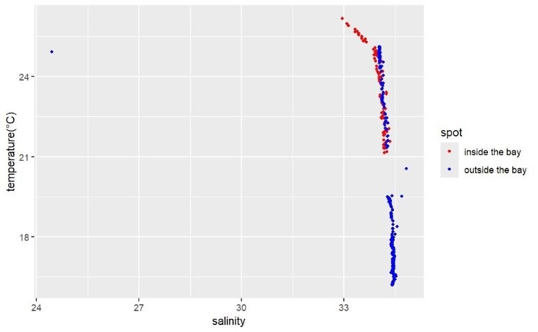
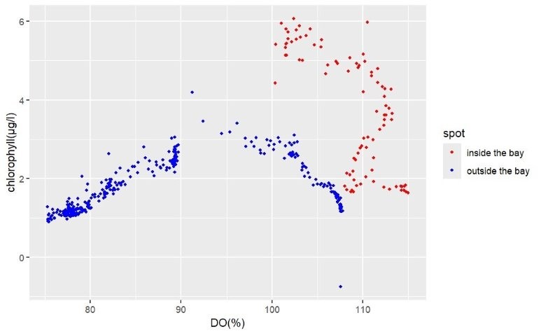
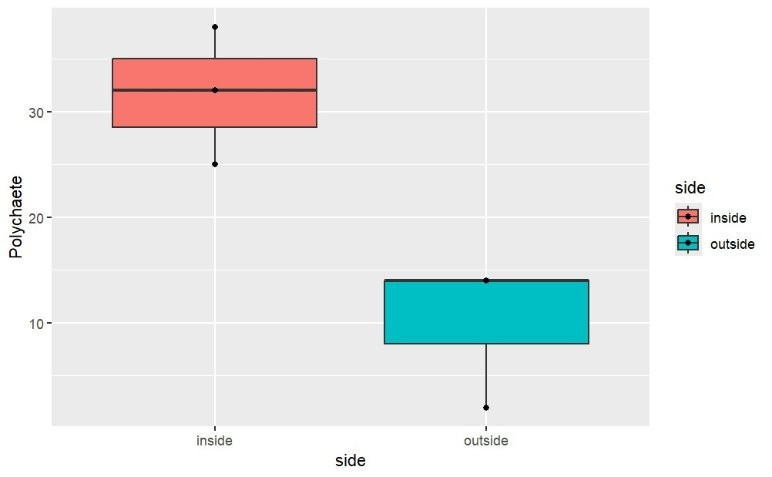
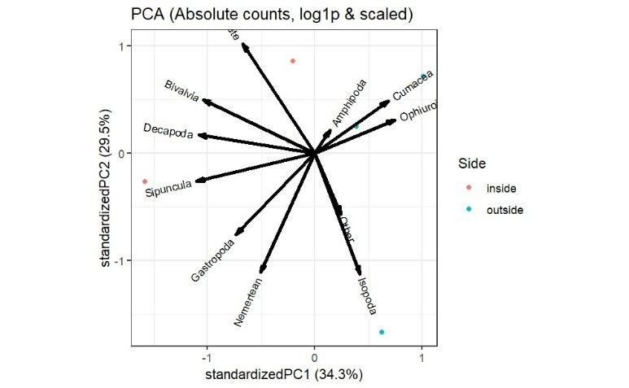

# 水圏生態学レポート

202411224 藥袋陽仁

## 導入・目的

海洋の生態系を考えるにあたり、河川の影響を無視することはできない。河川は淡水と陸域からの栄養塩を海洋に供給し、これが沿岸域の生物生産に大きな影響を与える。
本レポートでは、河川からの影響の有無という観点において、静岡県下田市下田湾内外の水質および底生生物群集の違いを調査し、これらに種類の水圏の生態の違いや河川の影響を考察することを目的とする。

## 方法

2025年8月26日、静岡県下田市湾内外において、河川の影響を受けることが予想される湾内および影響を受けないことが予想される湾外の2地点で調査を行った。これらの地点の座標は記録していない。
調査として以下の2つ、水質測定及び採泥を実施した。即ち、CTDを用い、各地点で電気伝導度、温度、水深、クロロフィルa濃度を測定した。また、底生生物の採取のために、スミス・マッキンタイヤー式採泥器を用いて各地点で採泥を行った。採泥は各地点で3回ずつ実施した。
採泥した試料は、海水を用いてふるい分けを行い、1mmメッシュで残った生物を取り分けた。顕微鏡下で適当な分類ごとの同定および個体数の計測を行った。今回用いた分類については別に示す。
観察された底生生物のデータとCTDのデータはRを用いて解析を行った。解析方法については別に示す。

### 底生生物の分類

詳細な種、分類群について同定はせず、多毛類、二枚貝類、腹足綱、端脚類、等脚類、クーマ類、十脚類、クモヒトデ、星口動物、紐形動物、その他の分類群に大まかに分けて記録した。

### Rを用いた解析

Rのバージョンは4.5.1 (2025-06-13 ucrt)である。パッケージはtidyverse、lubridate、ggplot2、veganを使用した。
CTDによって取得したデータはCSVファイルとして保存し、Rに読み込んで解析を行った。深度-水温、深度-塩濃度、深度-溶存酸素濃度、深度-クロロフィルa濃度、水温-塩濃度、クロロフィルa濃度-溶存酸素濃度の関係を散布図として描画した。
底生生物のデータもCSVファイルとして保存し、Rに読み込んで解析を行った。各地点での分類ごとの個体数をまとめ、ANOVAを用いて各分類の個体数に有意差があるかどうかを検定した。また、湾内外それぞれに各分類の占める比率を求め、ANOVAを用いて各分類の比率に有意差があるかどうかを検定した。有意差が認められた場合、箱ひげ図を用いて視覚的に比較した。
また、PCAを用いて各地点での底生生物群集の構造を解析し、群集の違いを評価した。
今回の解析に用いたコードはGitHubに保存してある。以下のURLからアクセスできる。

## 結果

CTDによる水質測定の結果を図1~6に示す。

: 図1. 深度-水温の関係

湾内では、表層から底層にかけて深度に対して一定に水温が低下する傾向が見られた。一方、湾外では、5m付近までに急激に水温が低下した。その後13m付近までは緩やかに水温が低下し、13mから20mにかけて水温が19.5℃付近でほぼ一定であった。20m近辺で極めて急激に水温が低下し、底層にかけて再び急激に水温が低下する傾向が見られた。

: 図2. 深度-塩濃度の関係

湾内では、表層で塩濃度が著しく低く、深度が増すにつれて塩濃度が高くなる傾向が見られた。一方、湾外では、深度による塩濃度の変化は比較的小さかった。

: 図3. 深度-溶存酸素濃度の関係

湾内では、表面から5m付近にかけて急激に溶存酸素濃度が低下し、その後8mにかけて表面と同程度まで回復した。その後、深度が増すにつれて溶存酸素濃度が低下する傾向が見られた。一方、湾外では、概ね水温と同様の変化が見られた。

: 図4. 深度-クロロフィルa濃度の関係

湾内では深度とともにクロロフィルa濃度が一定に増加する傾向が見られた。一方、湾外では、表面のクロロフィル濃度が湾内よりも小さく、10m付近までクロロフィルa濃度が増加し、その後は30m付近まで、表面と同程度まで減少した。その後、深度によらずクロロフィルa濃度はほぼ一定であった。

: 図5. 水温-塩濃度の関係

: 図6. クロロフィルa濃度-溶存酸素濃度の関係

同じクロロフィルa濃度において、湾内の方が湾外よりも溶存酸素濃度が高い傾向が見られた。また、湾内はクロロフィルa濃度が高いほど溶存酸素濃度が高い傾向が見られたが、一方、湾外ではクロロフィルa濃度と溶存酸素濃度の間に明確な関係は見られなかった。

各地点での底生生物の分類ごとの個体数の結果を表1に示す。

: 表1. 各地点での分類ごとの個体数

|No.|side|多毛類|二枚貝類|腹足綱|端脚類|等脚類|クーマ類|十脚類|クモヒトデ|星口動物|紐形動物|その他|
|-|-|-|-|-|-|-|-|-|-|-|-|-|
|1|湾内|38|5|0|1|0|0|1|2|1|0|1|
|2|湾内|25|5|6|1|0|0|2|0|13|6|10|
|3|湾内|32|2|26|3|0|0|0|0|7|1|11|
|4|湾外|14|2|1|0|0|0|0|2|0|0|2|
|5|湾外|14|6|27|3|0|3|0|1|0|0|3|
|6|湾外|2|0|2|1|1|0|0|1|1|8|6|

ANOVAの結果、多毛類についてのみ有意差が認められた(p < 0.05)。箱ひげ図を図8に示す。

: 図8. 多毛類の個体数の箱ひげ図

各地点での分類ごとの占める比率の結果を表2に示す。ANOVAの結果有意差が認められた分類はなかった。

PCAの結果を図9に示す。第1主成分と第2主成分で全体の63.8%の分散を説明している。

: 図9. PCAの結果

## 考察

### CTDによる水質測定

CTDによって取得した湾内のデータから、特に溶存酸素濃度および塩濃度について注目する。
深度-塩濃度の関係を見ると、湾内では表層で塩濃度が著しく低く、深度が増すにつれて塩濃度が高くなる傾向が見られた(図2)。これは、河川からの淡水の流入によって表層の塩濃度が低下していることを示唆している。即ち、湾内は湾外と比較して河川の影響を受けていると考えられる。
また、深度-溶存酸素濃度の関係を見ると、湾内では表面から5m付近にかけて急激に溶存酸素濃度が低下し、その後8mにかけて表面と同程度まで回復した。その後、深度が増すにつれて溶存酸素濃度が低下する傾向が見られた(図3)。一方で酸素を賛成する色素であるクロロフィルaの濃度は深度とともに増加する傾向が見られた。このことから、湾内における表面から水深5m付近までの溶存酸素濃度の低下は、河川からの有機物の流入に伴う微生物の呼吸による酸素消費が影響している可能性が考えられる。

### 底生生物群集の分析

底生生物の分類ごとの個体数を見ると、多毛類についてのみ湾内外で有意差が認められた(図8)。一方、各分類の占める比率については有意差が認められなかった。したがって、単純に底生生物の総個体数の違いが、湾内外の環境の違いを反映している可能性がある。
PCAの結果を見ると、湾内外で明確に群集構造が分かれているとは言えない(図9)。ただし、第一主成分の負の方向に湾内のサンプルが多く分布していることから、第一主成分が湾内外の環境の違いを反映している可能性がある。
十脚類を除く節足動物(端脚類、等脚類、クーマ類)は湾外で多く観察された。一方十脚類は湾内でのみ観察された。ただし、これらの分類の分布と環境要因との関係は明確にできなかった。
